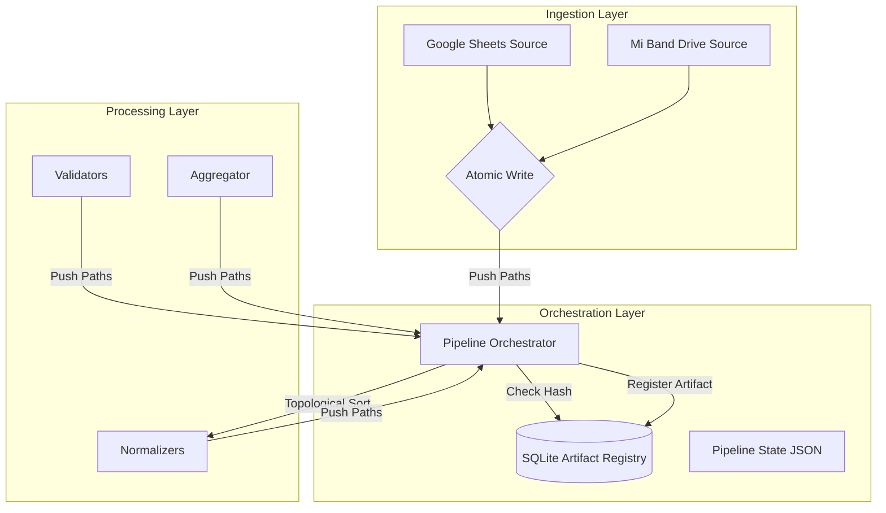

# Personal Data Platform (PDP)


A production-grade, artifact-driven data engineering pipeline designed to ingest, normalize, and aggregate personal health telemetry (Blood Pressure, Heart Rate, Sleep) from heterogeneous sources.

**Core Engineering Signal:** This project demonstrates **Idempotency**, **Atomic I/O**, **Cache-Aware Execution**, and **Metadata Management** without relying on heavy external frameworks like Airflow or Dagster.

## 🏗 Architecture

The pipeline follows a **Push-Model** architecture where nodes return explicit artifact paths, coordinated by a central Orchestrator backed by a SQLite Registry.


## 🚀 Key Features
### 1. Cache-Aware Execution (Memoization)
The Orchestrator calculates a deterministic Input Hash for every stage, combining:
* **Data Identity:** SHA-256 content hash of input files.
* **Code Identity:** AST-based source code hashing of logic classes (inspect.getsource).
* **Config Identity:** State of global settings and pyproject.toml.
If the hash matches a valid entry in the Registry, the stage is skipped entirely (0ms execution time).
### 2. Atomic I/O (Write-Ahead Log Pattern)
To prevent "Zombie Artifacts" (corrupted files from crashed runs), the pipeline uses an **Atomic Rename Pattern**:
1. Write: Nodes write to filename.csv.<uuid>.tmp.
2. Verify: Node returns success.
3. Commit: Orchestrator performs an OS-level atomic rename (replace()) to .csv and registers the metadata in the same transaction scope.
### 3. Artifact Registry
Metadata is treated as a first-class citizen. A SQLite backend tracks:
* **Lineage:** Which inputs produced which outputs.
* **Versioning:** Automatic v1, v2 incrementing.
* **Audit:** Execution timestamps and row counts.
### 4. Dual-Mode Visualization
The Streamlit dashboard implements a **Hybrid Auth** pattern:
*   **Public View:** Automatically loads synthetic data (Mock Mode) for demonstration purposes, ensuring zero-click value for visitors.
*   **Private View:** An authenticated sidebar login unlocks the real telemetry data (decrypted from cloud secrets) for the owner.
*   **UX:** Features Altair charts with magnetic crosshairs, dynamic date filtering, and physiological threshold markers.

### 5. Cloud State Sync (Stateless Compute)
To support ephemeral environments (Docker/GitHub Actions), the pipeline implements a **Remote State** architecture.
*   **Pull:** On startup, `entrypoint.sh` downloads the SQLite Registry and Merged Metrics from a secure Google Drive folder.
*   **Push:** After execution, updated state is atomically uploaded back to Drive.

## 🛠️ Setup & Usage
### Prerequisites
* Python 3.10+
* Google Cloud Service Account (Drive & Sheets API enabled)

### Installation
```bash
# 1. Clone the repo
git clone https://github.com/YOUR_USERNAME/personal-data-platform.git
cd personal-data-platform

# 2. Install dependencies
pip install -e .

# 3. Configure Secrets
cp .env.example .env
# Edit .env with your Google Credentials path and IDs
```

### Running the Pipeline

The CLI (main.py) supports granular control over execution.
```bash
# Standard Run (Ingest -> Normalize -> Validate -> Merge)
python main.py

# Skip Ingestion (Use existing raw files)
python main.py --skip-ingestion

# Resume from a specific stage (e.g., Validation)
python main.py --start-stage validation

# Clean up all generated artifacts (Dry Run)
python main.py --clean --dry-run

# Run Dashboard (Auto-switches based on env vars)
streamlit run dashboard.py

# Run via Docker (Stateless)
docker build -t pdp .
docker run --rm --env-file .env -v $(pwd)/.secrets:/app/.secrets pdp
```
## 📂 Project Structure
```text
personal-data-platform/
├── config/             # Pydantic settings & logging config
├── ingestion/          # Source connectors (Strategy Pattern)
├── pipeline/           # Core Engine
│   ├── orchestrator.py # DAG execution & Caching logic
│   ├── registry_sqlite.py # Repository Pattern for Metadata
│   └── nodes.py        # Stage wrappers
├── processing/         # Business Logic (Normalizers/Validators)
├── scripts/            # Utility scripts (Sync, Mock Data)
├── dashboard.py        # Streamlit Visualization Layer
├── Dockerfile          # Multi-stage build definition
├── fly.toml            # Cloud deployment config
├── entrypoint.sh       # Cloud state synchronization logic
└── main.py             # CLI Entrypoint
```

## 🛡️ Design Patterns Used

* Repository Pattern: Decoupling database access from domain logic (registry_sqlite.py).
* Strategy Pattern: Interchangeable ingestion sources (ingestion/interfaces.py).
* Inversion of Control: Nodes "push" results to the Orchestrator rather than the Orchestrator "pulling" from hardcoded paths.
* Guard Clauses: Enforcing "Identity > Status" in execution logic.

## 🔜 Roadmap

- [x] DAG Topological Sort
- [x] SQLite Artifact Registry
- [x] Atomic File Operations
- [x] Visualization Layer (Streamlit/Altair)
- [x] Docker Containerization & Cloud Sync
- [x] CI/CD (GitHub Actions -> Fly.io)
- [ ] Unit Tests for DAG Logic